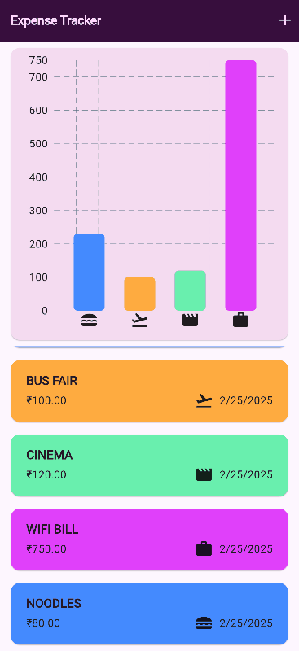
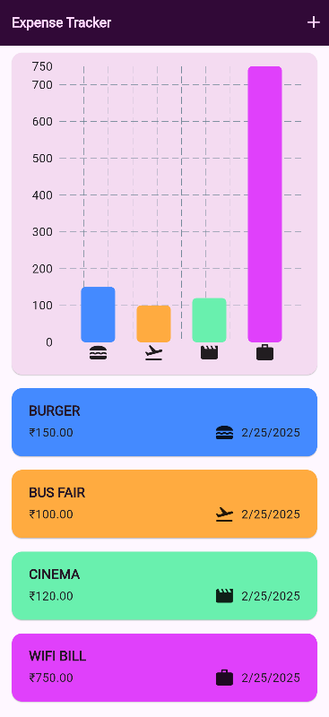
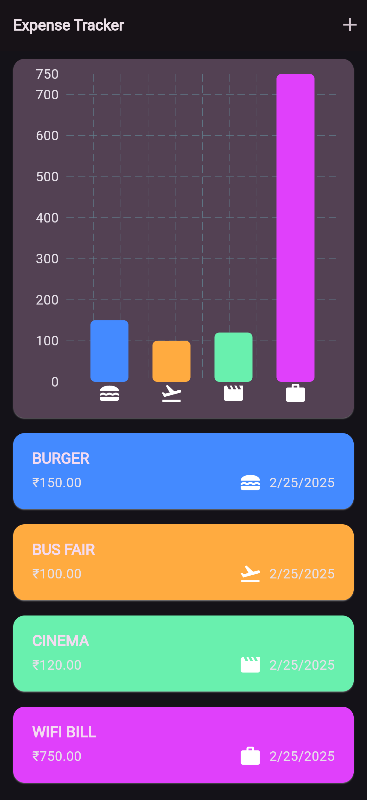
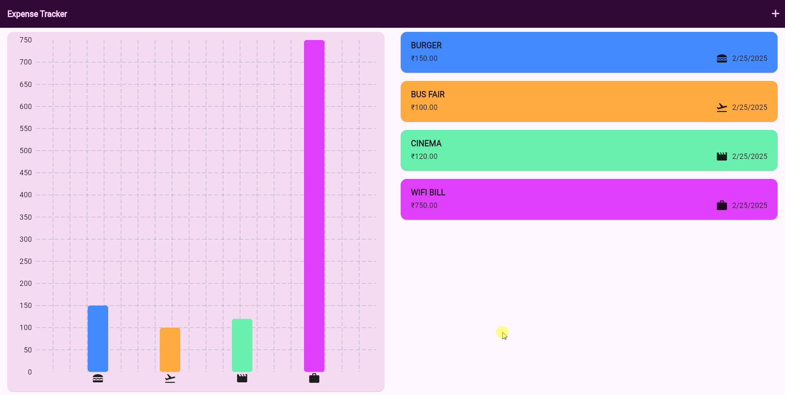
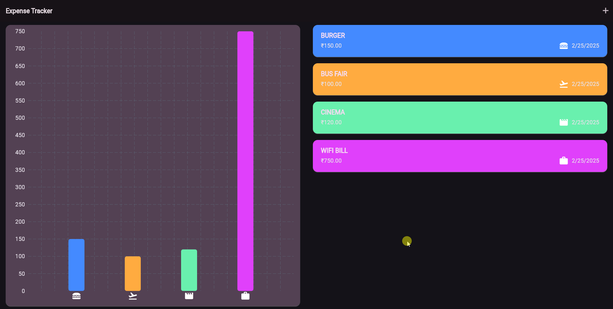

# 💸 Expense Tracker App

🚀 Excited to share my latest Flutter project! 🚀

## Demo 


---

## 🚀 Features

- 📊 **Bar Chart Visualization** using `fl_chart` for clear expense insights.  
- 📝 **Dynamic Expense List** — real-time updates when adding or removing expenses.  
- ➕ **Add New Expense** through a smooth **Bottom Sheet** interface.  
- 🎨 **Category Icons & Colors** for better clarity and quick filtering.  
- 💡 **Light & Dark Theme** support — switch based on your preference.  
- 📱 **Responsive Design** — works flawlessly on mobile & tablet screens.  

---

## 📷 Screenshots
<!-- Add images to showcase features -->  
| Light Mode | Dark Mode |  
|------------|-----------|  
|  |  |  
|  |  |  

---

## 🛠️ Tech Stack

- **Flutter** 💙  
- **fl_chart** 📊  
- **Dart** 🚀  

---

## 🚀 Getting Started

1. **Clone the repo:**  
   ```bash  
   git clone https://github.com/thariqaz-dev/flutter-expense-tracker-app.git  
   ```  

2. **Navigate to project:**  
   ```bash  
   cd flutter-expense-tracker-app  
   ```  

3. **Install dependencies:**  
   ```bash  
   flutter pub get  
   ```  

4. **Run the app:**  
   ```bash  
   flutter run  
   ```  

---

## 📬 Feedback

Have suggestions or found a bug? Open an issue or submit a pull request! 🙌  

---

## 📄 License

This project is licensed under the **MIT License**.